# picoram6116

A Raspberry Pi Pico (RP2040)-based 6161 SRAM Emulator, SD Card
Interface, and Multi-Expansion for the [Multitech Microprofessor
MPF-1B and MPF-1P SBCs (Single Board
Computers)](https://hackaday.io/project/183618-exploring-the-microprofessor).

Demo videos:
- [PicoRAM 6116 Demo Video with MPF-1B / Rev. 3 PCB](https://youtu.be/Uu-U00VHX-8)

- [PicoRAM 6116 Demo Video with MPF-1P / Rev. 4 PCB](https://youtu.be/QXIxJ-ij4dM)

The [development
logs](https://hackaday.io/project/194092-picoram-6116-sram-emulator-sd-card-interface)
are on [Hackaday.](https://hackaday.com).

This project is a follow-up to [PicoRAM 2090 for the Busch Microtronic
Computer System](https://github.com/lambdamikel/picoram2090); also
see the [development logs on
Hackaday.](https://hackaday.io/project/192655-picoram-2090)

### PicoRAM 6116 with the MPF-1B - older PCB Rev. 3 

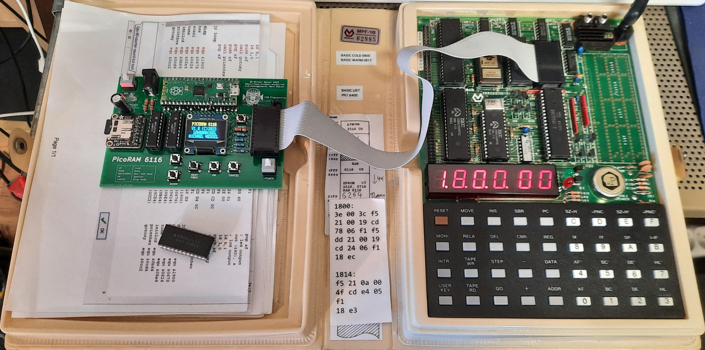

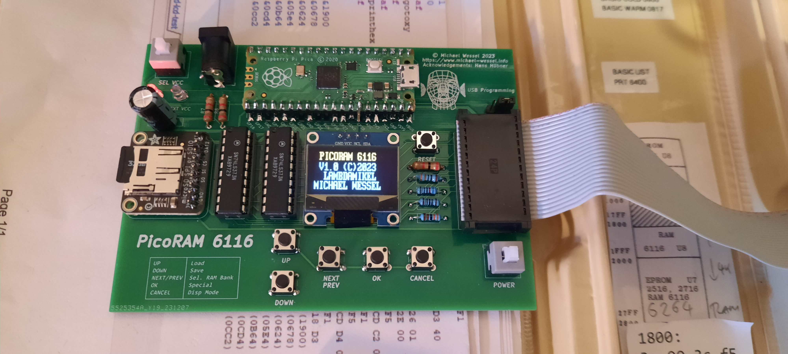

### PicoRAM 6116 with the MPF-1P (IP / One Plus) - current PCB Rev. 4 

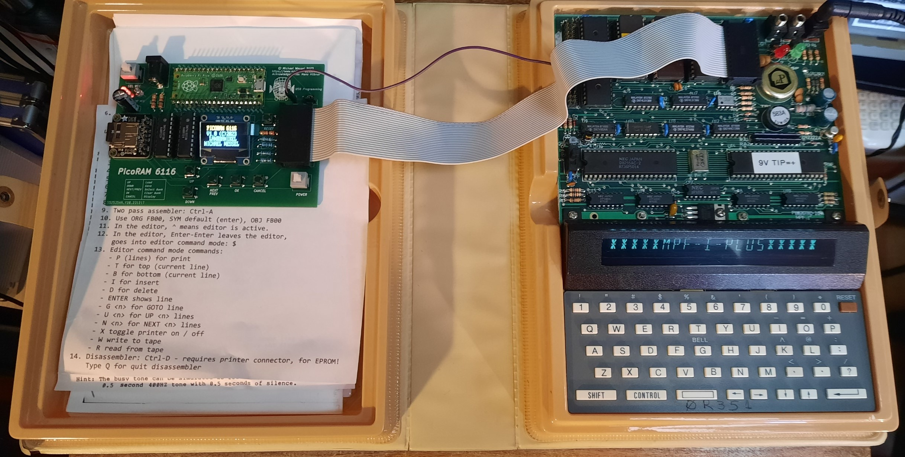

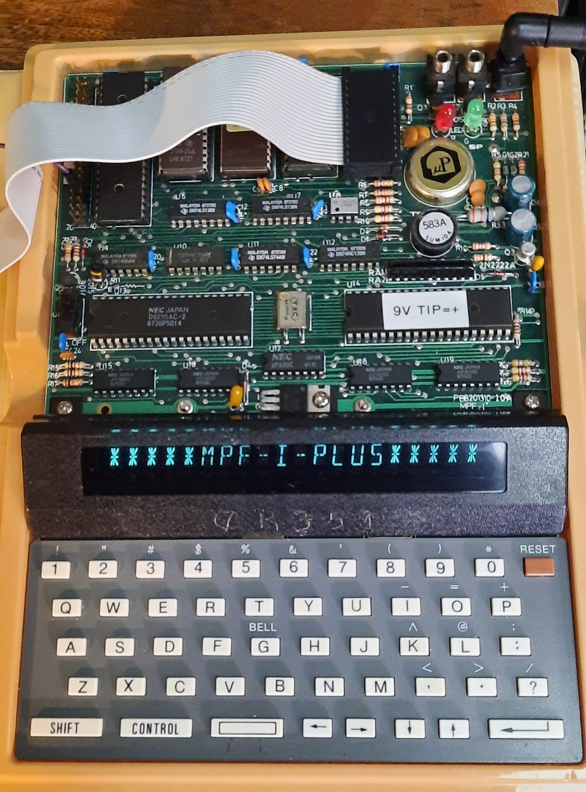

## Latest News

### December 17th 2023

[Hackster covered the PicoRAM
6116.](https://www.hackster.io/news/michael-wessel-s-raspberry-pi-pico-powered-6116-sram-emulator-gives-vintage-sbcs-a-major-overhaul-2324810b773c)

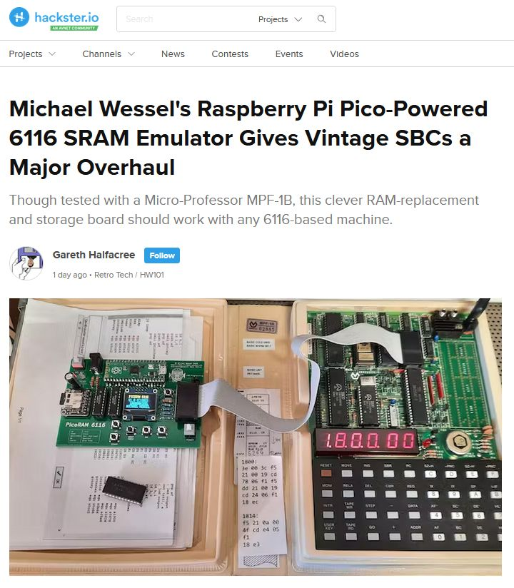

I also archived [the PDF of the Hackster article.](pics/hackster-article.pdf)


## About

**PicoRAM 6116 is the ultimate expansion for the vintage Microprofessor SBCs.**

Features:

- SD card interface: loading and saving of programs (full SRAM memory
  dumps) and easy file exchange with the PC (FAT32 filesystem). ASCII
  HEX format, additionally supporting comments and target addresses.

- Plugs into the U8 6116 socket on the MPF-1B
  (address range `0x1800 - 0x1FFF`) or the U5 6116 socket on the MPF-1P
  (address range `0xF800 - 0xFFFF`).

- Comfortable UI: 5 buttons and OLED display.

- 4 user memory banks: the currently active memory bank can selected
  over the UI; each bank hosts a full 6116 SRAM.

- Autoload feature: the `6116.INI` file is loaded during startup
  and allows the specification of an autoload program for each of the 4
  memory banks. 

- Easy build & installation: PicoRAM 6116 uses pre-assembled
  off-the-shelf modules and through-hole components only, and no
  (destructive) modifications to the Microprofessor are required.

## Usage

The JP1 Jumper should be in the right position:

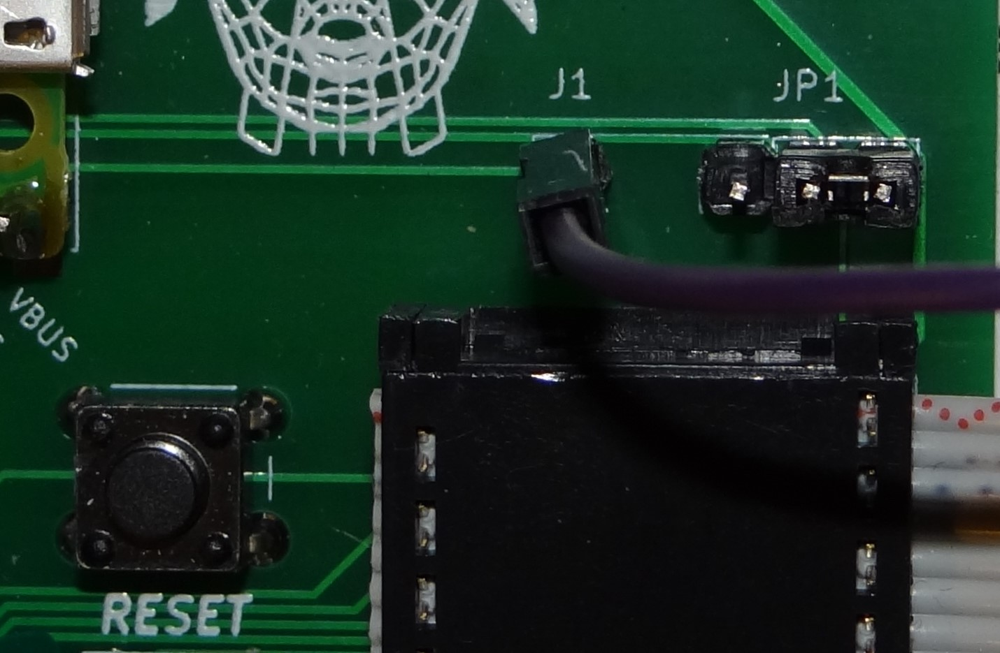

The current version is PCB Rev. 4. This PCB hosts an extra single pin
connector (J1). Connect J1 to the Microprofessor's WAIT on the
expansion header (PIN 37):

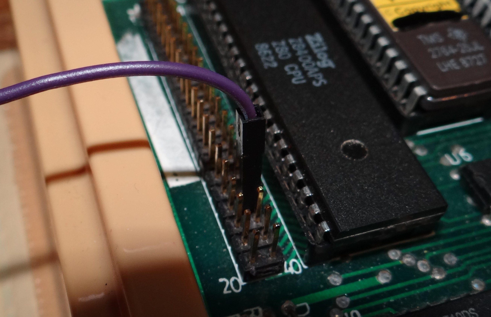

If you don't use the J1 to WAIT connection, you will need to hold the
Microprofessor in RESET while operating PicoRAM - see the [Rev. 3 Demo
Video](https://youtu.be/Uu-U00VHX-8).  However, this is no longer
required with Rev. 4 (the current version from this repository) - as
shown in [the Rev. 4 demo video](https://youtu.be/QXIxJ-ij4dM)). This
video shows the MPF-1P, but it also applies to the MPF-1B.

PicoRAM needs a FAT32-formatted (max 32 GB) Micro SD Card. Copy the
appropriate `6116.INI` file to it, and get the correct demo programs
for your machine (MPF-1B or MPF-1P). Unzip everything to the root
directory; sub-directories are not supported. See [this
directory.](software/)

PicoRAM 6116 is usally powered over the 6116 SRAM socket. Make sure
that the **POWER** button is pushed down, and that the **SEL VCC**
(Power Source) is set to **6116 VCC**. External power supply is
possible as well, using the 5V Center Positive Barrel Jack. However,
this should not be required. The LEDs **6116 VCC** and **EXT VCC**
light up indicating which power sources are available (i.e., if both
**EXT VCC** and **6116 VCC** light up, it means that you have power
over the 6116 Socket from the Microprofessors, as well as VCC from the
external power supply). Then, use the **SEL VCC** switch to determine
the utilized power source (either external or internal). If you have
an external power source connected, but **EXT VCC** stays dark, then
you probably have the wrong polarity.

### `6116.INI` File

The 5 UI buttons are using the Pico's analog input. Unfortunately, the 
analog levels turned out to be very noisy and also vary from machine
to machine. So it might be necessary for you to "tune" these
analog threshold levels to match your machine. The `6116.INI` file
supports this. The init file looks as follows for the MPF-1B
(not that UNIX EOL is required! a single newline / `0x0A` character):

```
MPF-1B
D00
C00
900
700
300
100
CLOCK.MPF
DICE2.MPF
COUNTER2.MPF
EGGTIME.MPF
0
```

The file lists, in this order:
- the name of the machine
- the analog threshold for the CANCEL buttons (using during YES/NO dialogues) 
- the 2nd analog threshold for the CANCEL buttons (toplevel buttons)
- the analog threshold for the OK button
- the analog threshold for the NEXT/PREV button
- the analog threshold for the UP button
- the analog threshold for the DOWN button
- 4 lines for the 4 autoload programs for banks 0 to 3 - use an empty line for no program
- 0 or 1; 0 for normal operation, and 1 is used to enter a debugging program which can be used to determine the above analog threshold for the buttons above.

Note that the default init files for the MPF-1B and MPF-1P are
supplied, and that the analog thresholds differ. They were determined
with the author's machines, and might not work for your machine.

## Theory of Operation

The Pico emulates the 6116 SRAM of the Microprofessor:

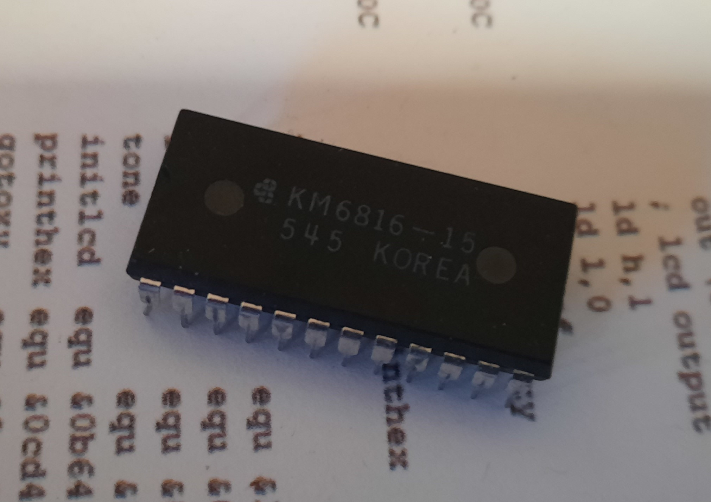

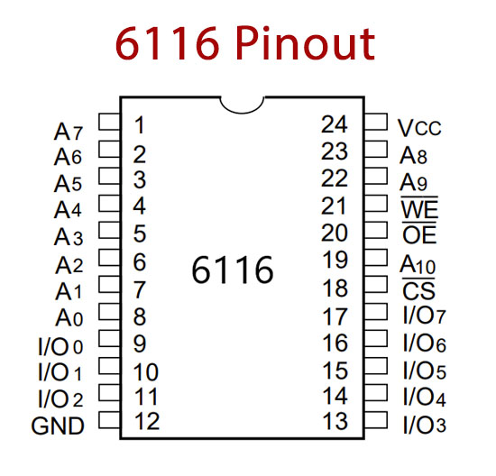

The Pico is overclocked to 250 Mhz to make this possible; this
is completely in the safe range and does not affect the longevity
of the RP2040 in any negative way. 

Due to a lack of GPIOs on the Pico, I used two 74LS373 transparent
octal latches to multiplex the 11-bit address bus. The 11-bit address
is read in two batches of 6 and 5 bits, using the `SEL1` and `SEL2`
signals from the Pico to OE (Output Enable) the first resp. second
latch. The latches are merely used for their tri-state capabilities.

Unlike my previous design, [PicoRAM
2090](https://github.com/lambdamikel/picoram2090), this design does
not utilize any voltage level converters.  It turns out that the Pico
(RP2040) is really pretty much 5V-tolerant; also see [this article
from
Hackaday](https://hackaday.com/2023/04/05/rp2040-and-5v-logic-best-friends-this-fx9000p-confirms/)
and the [Hackaday coverage of PicoRAM
2090.](https://hackaday.com/2023/09/10/pi-pico-becomes-sram-for-1981-educational-computer/)

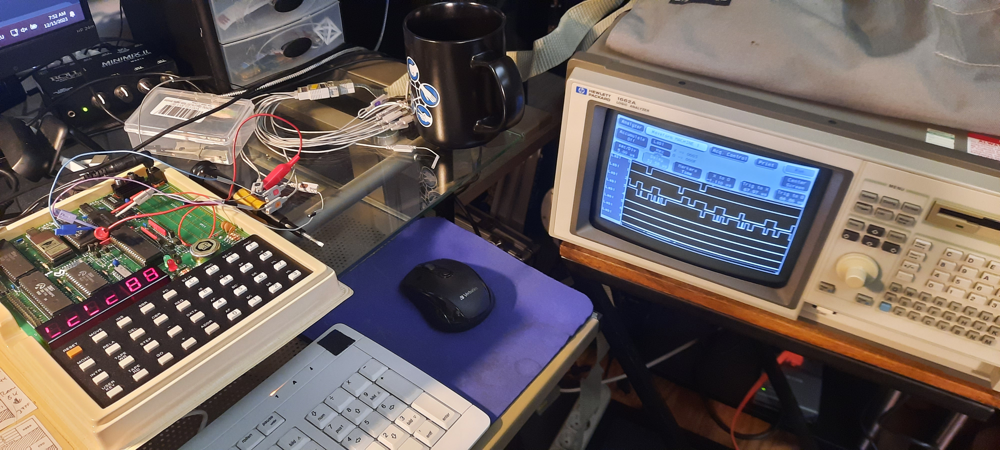

More details about the making of the project, and technical notes / development log can be found on the [Hackaday project page.](https://hackaday.io/project/194092-picoram-6116-sram-emulator-sd-card-interface)

Schematics:

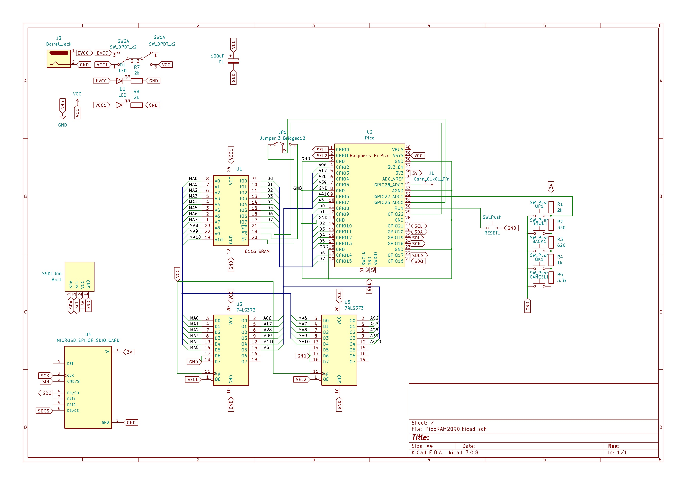

## PCB

The current version is Rev. 4, December 2023.

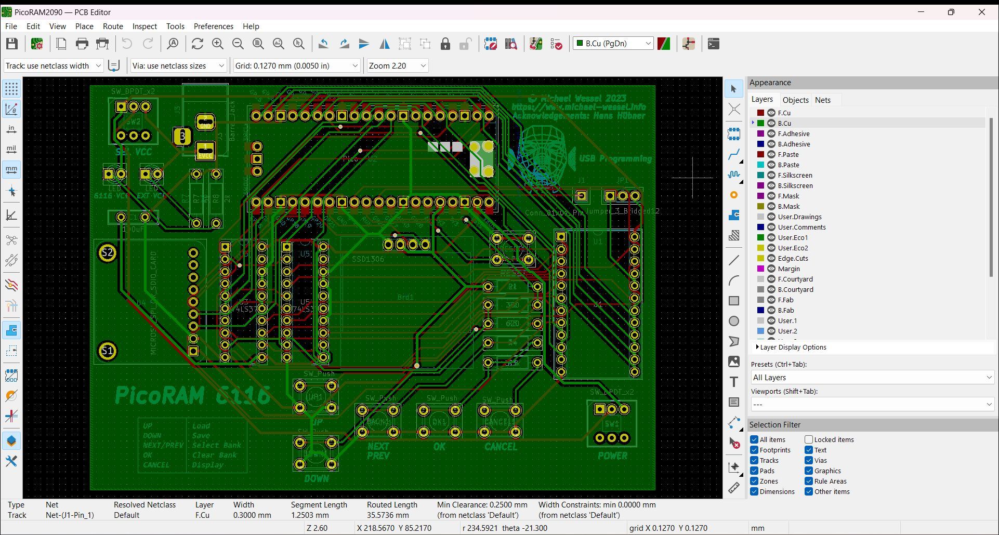

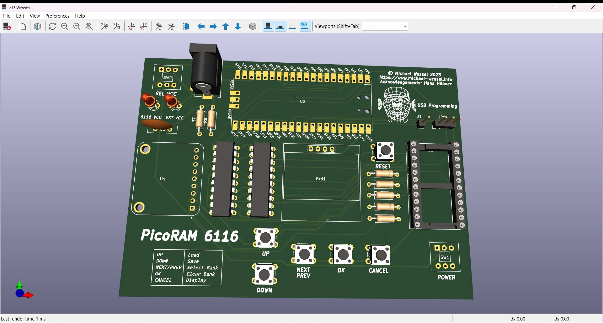

There is also a [Bill of Material (BOM).](gerbers/PicoRAM6116.csv) 

### Gerbers 

See [here.](gerbers/PicoRAM6116-Gerbers.zip) 

## Firmware Image

The current version is 1.1, December 2023 and the `.uf2` image can be
found [here.](firmware/v1.1/sram6116.uf2)

## Firmware Sources

Soon. 

## Acknowledgements

- Harry Fairhead for his [execellent
  book!](https://www.amazon.com/gp/product/1871962056)

- Hans Hübner (aka Pengo) for motivating me to abandon the BluePill,
ATmegas and Arduinos, and for helping to get started and
troubleshooting!

- The authors of the libraries that I am using:

  - Carl J Kugler III carlk3:
    [https://github.com/carlk3/no-OS-FatFS-SD-SPI-RPi-Pico](https://github.com/carlk3/no-OS-FatFS-SD-SPI-RPi-Pico)

  - Raspberry Pi Foundation for the `ssd1306_i2c.c` demo.

